# Workshop 2

## Agenda

Create infrastructure:
- S3 bucket (5min)
- Two databases on RDS: SQL Server (production) and Postgres (data warehouse) (45min)
- DMS to import and transform data. Create and test connections (30-45 min)
- Import data (30min)
- Move data from production database into data warehouse using DMS (20min) 

## Task: Create an S3 bucket
This bucket will contain the backup database files that will be loaded to the database later on.

1) Download the two datasources to your local machine.
	- [production](https://github.com/Microsoft/sql-server-samples/releases/download/adventureworks/AdventureWorks2019.bak)
 	- [data_warehouse](https://github.com/Microsoft/sql-server-samples/releases/download/adventureworks/AdventureWorksDW2019.bak)
2) Go to S3 console, select Buckets than `Create Bucket`. 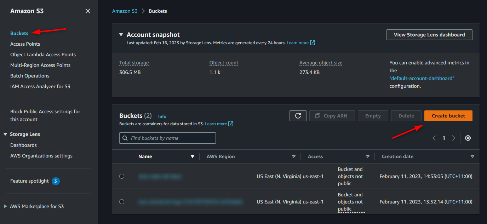
3) Write a unique bucket name (name has to be unique among all of the S3 buckets from ALL AWS accounts).
4) Let all Default configuration and Click `Create Bucket`.
5) Click on the Bucket you just created and then click on `Upload`. 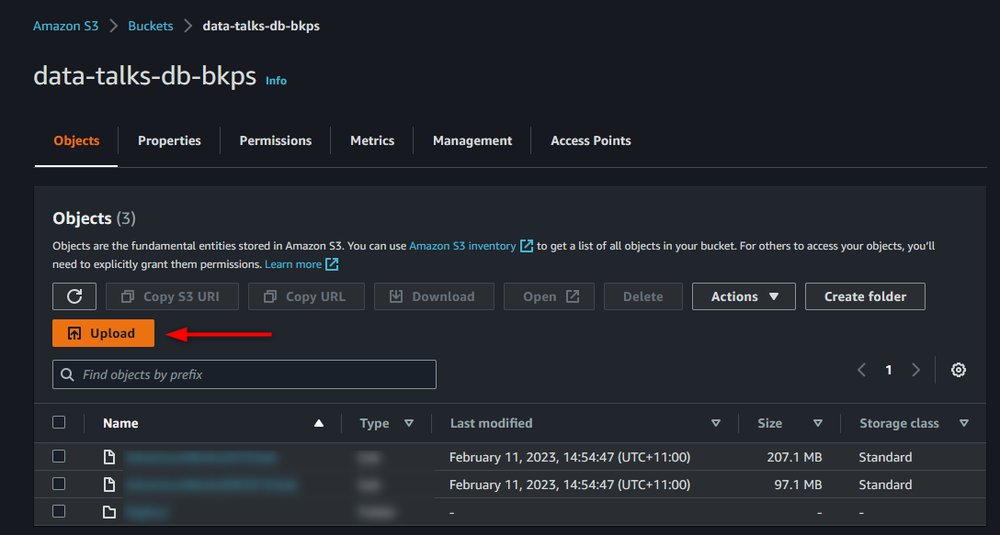
6) `Drag and drop` the files you want to upload or choose `Add files`. (Add the two .bak  you have downloaded previosly into the bucket)
8) Click on `Upload`

## Task: VPC and Security Group

For this lab, we will use the default VPC but let's create a new `security group`.

1) Go to `VPC`, `Security Group` and click `Create security group`. 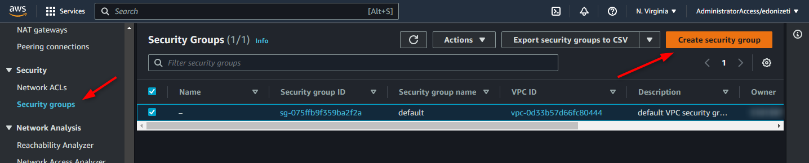
2) Give a name and a description to the `Security group` and in Inbound rules click on `Add rule` (We will create two rules, one for MSSQL and another for PostgreSQL).
3) Change `Type` to `MSSQL` and `Source` to `My IP`. Then `Add a new Rule` and set the type as `PostgreSQL` and the Source as `My IP` too and click `Create security group`. 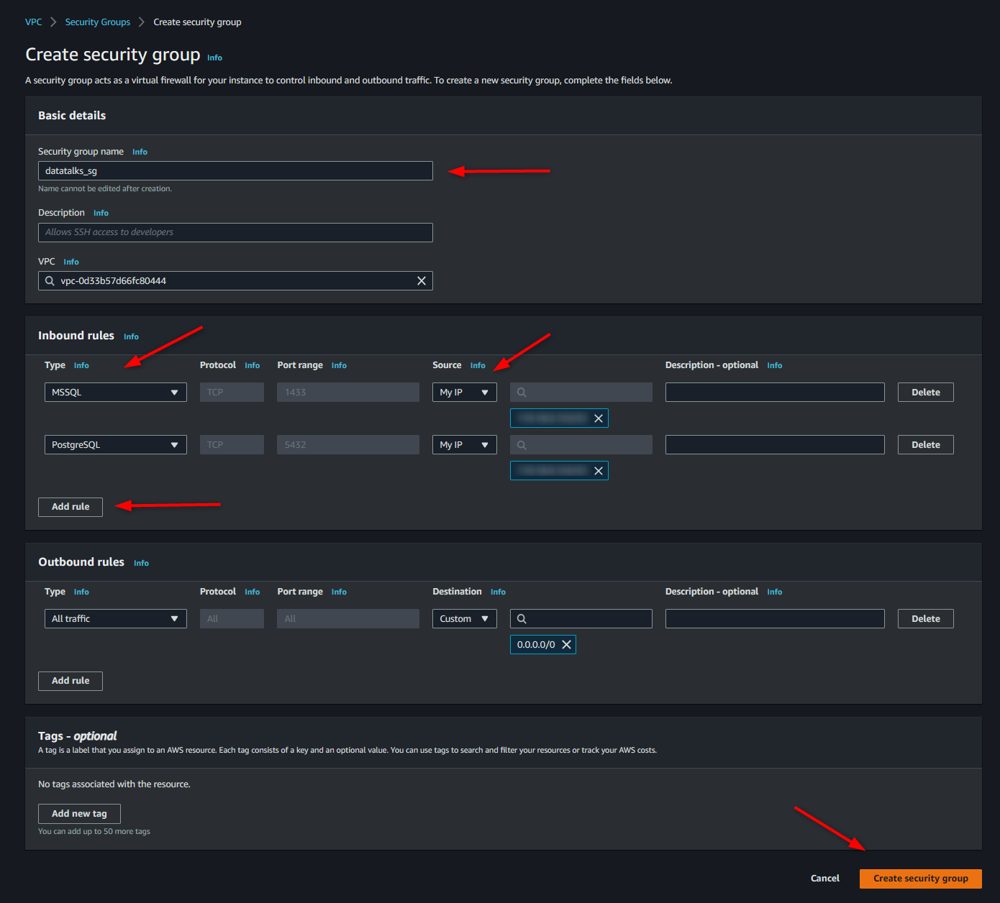 

## Task: Create an RDS instance

In this lab, we are going to create 2 RDS instances (MSSQL and PostegreSQL). In MSSQL we will have two databases (Produtão and Data Warehouse), however, it is not advisable to have these two databases in the same instance. Because of this, we are going to use AWS DMS to migrate the data from the Data Warehouse database to a new database in the PostgreSQL instance.

The cost of RDS instances is related to the size and type of the instance, so a larger and more powerful instance equals to a more expensive database. Another factor in the cost is licensing. Oracle and Microsoft charges licensing so you might be in a situation where even though the computer that is running the database is free, but you have to pay for the software that is running on the instance. MySQL and Postgres are open source so no licensing on these two engines.

Steps:
1) Go to `RDS` console, click on `Databases` and `Create database`.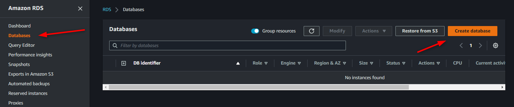
2) Let's start by creating the PostgreSQL instance. In the Engine options select PostgreSQL and In Templates select the option Free tier.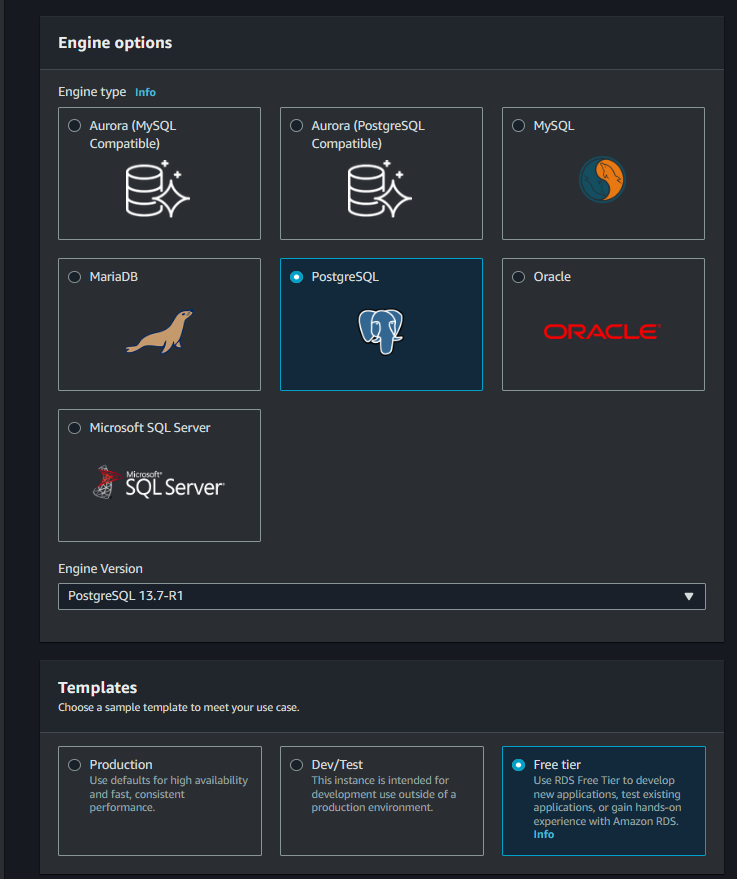
3) In Settings, type a name and a password for your DB Instance. 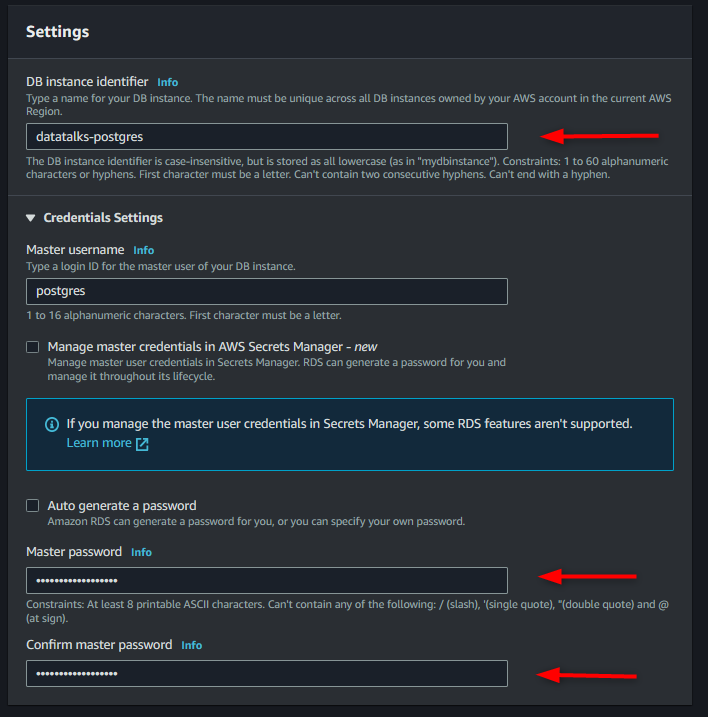
4) Under Connectivity, check the `Public Access` option as `Yes` and select the `security group` we created earlier (remember to remove the default security group). As we are just learning about RDS and the data is public available, this option is okay. In real life, the database will be in a Private subnet and only accessible, securely, via resources in the AWS or through a VPN. Leave the other options as default. 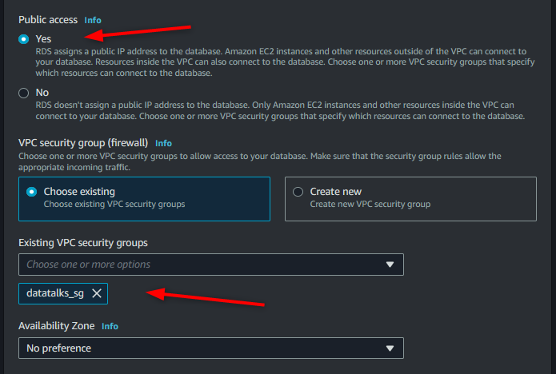
5) Under `Additional configuration`, define an `Initial database name` and click on `Create Database` 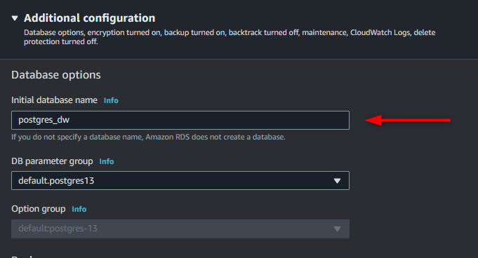
6) While the Postgres instance is being created, let's configure the Group Options for MSSQL. Click `Group Options` and then `Create Group`.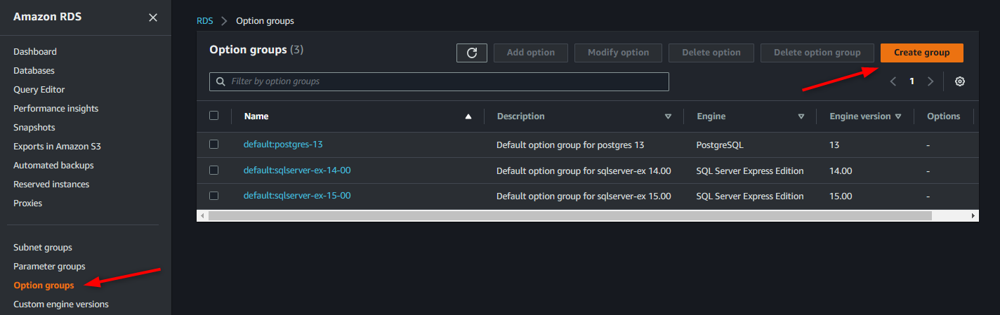
7) Define a `name and description` for the new group and select the `Engine` and `Version` according to the MSSQL version you are going to create and click on `create`. (We will use the engine `sqlserver-ex` version `15.00`) 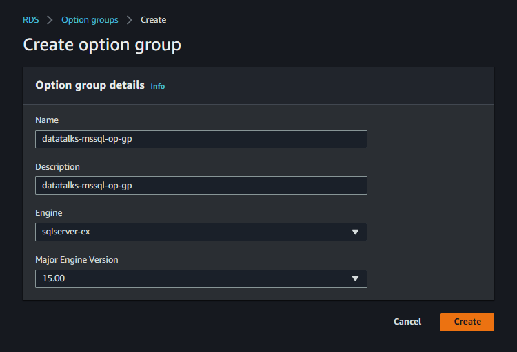
8) In `Options Group`, select the group created and click on `Add option`.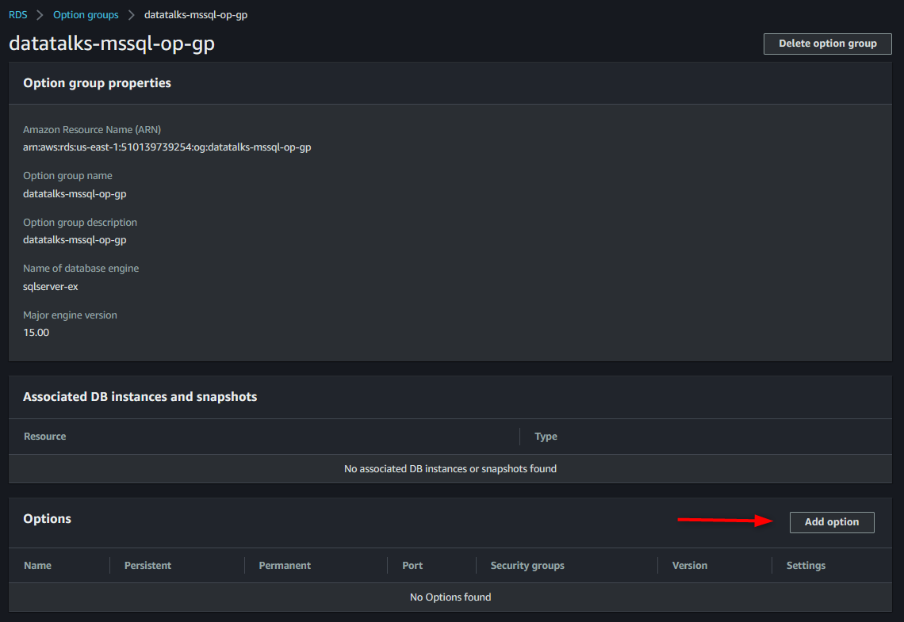
9) In option details select `SQLSERVER_BACKUP_RESTORE`. In IAM role select `Create a new role` and give a name for the new role. In S3 destination, select the bucket you created earlier and in Scheduling select `Immediately`. Finally, click on `Add option`.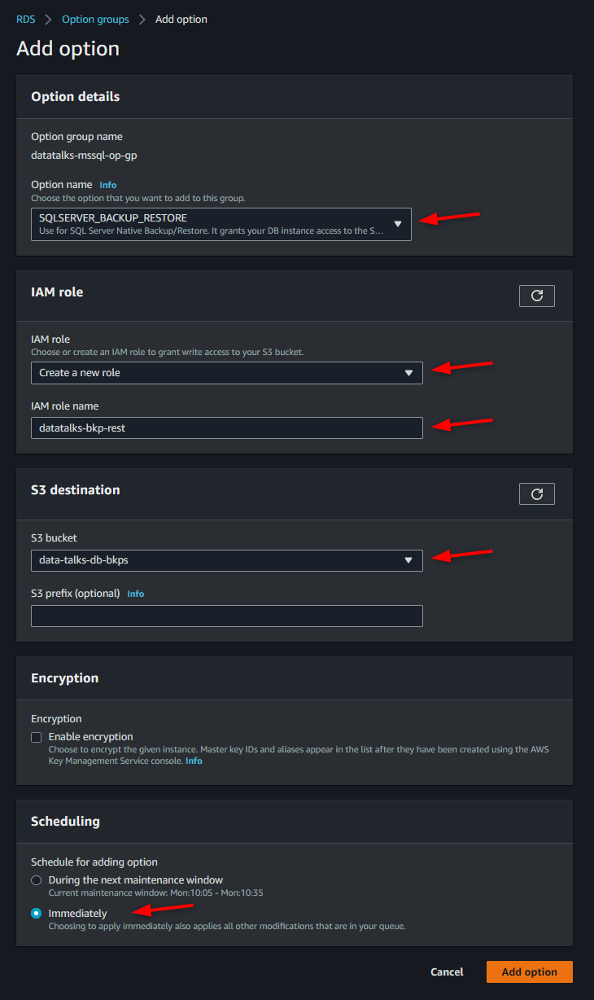
10) Now let's create the MSSQL. Go to Database and select `Create New Database`. Select `MSSQL Express Edition` engine `15`. Define a name and a password for the database. Under Connectivity, check the `Public Access` option as `Yes` and select the `security group` we created earlier (remember to remove the default security group). Under additional settings, in `option group`, select the group that was created earlier and click `Create Database`.
 
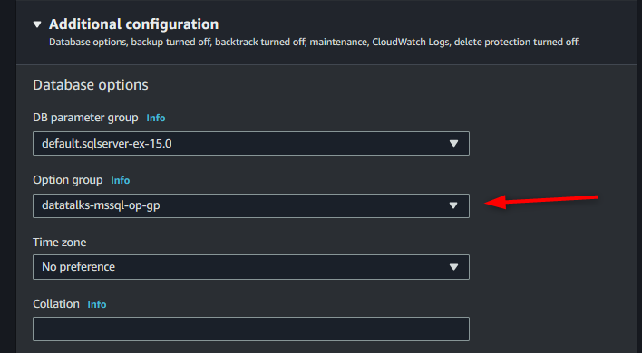
	

This paper goes into more details about each option:
https://docs.aws.amazon.com/AmazonRDS/latest/UserGuide/USER_CreateDBInstance.html

<br />

## Task: Connect to Databases and restore a dataset into RDS SQL Server

To restore the .bak files in the MSSQL instance we will need to use an IDE. In this lab we will be using [DBeaver Community](https://dbeaver.io/), a free universal database tool.

This [tutorial](https://docs.aws.amazon.com/AmazonRDS/latest/UserGuide/SQLServer.Procedural.Importing.html) gives an overview of the process.

Steps:
1) Once `DBeaver` is installed, let's create a connection with the MSSQL Instance. Click on the `new connection` and then select the desired database (In this case `SQL Server`) and then click on `Next`. 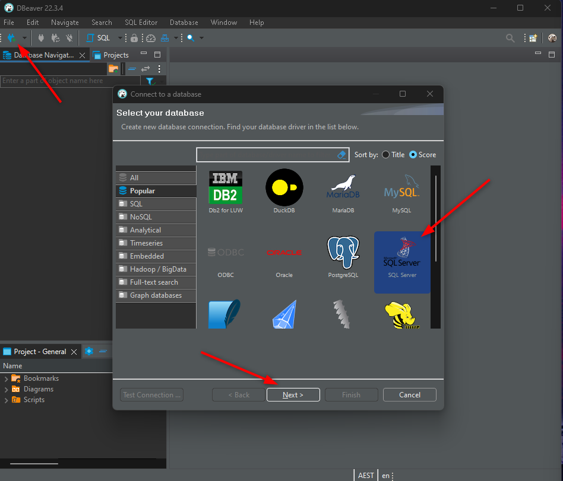
2) In the `AWS console`, go to `RDS`, `Databases` and click on the `MSSQL instance`. Under `Connectivity & security`, copy the `Endpoint`. 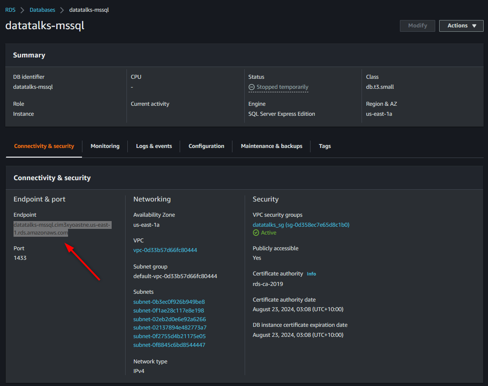 
3) In `DBeaver`, in server, put the `Endpoint` as `Host`, inform the `user` and `password` and click `Test Connection` (DBeaver may ask you to download `connection drivers`). Click `Finish` 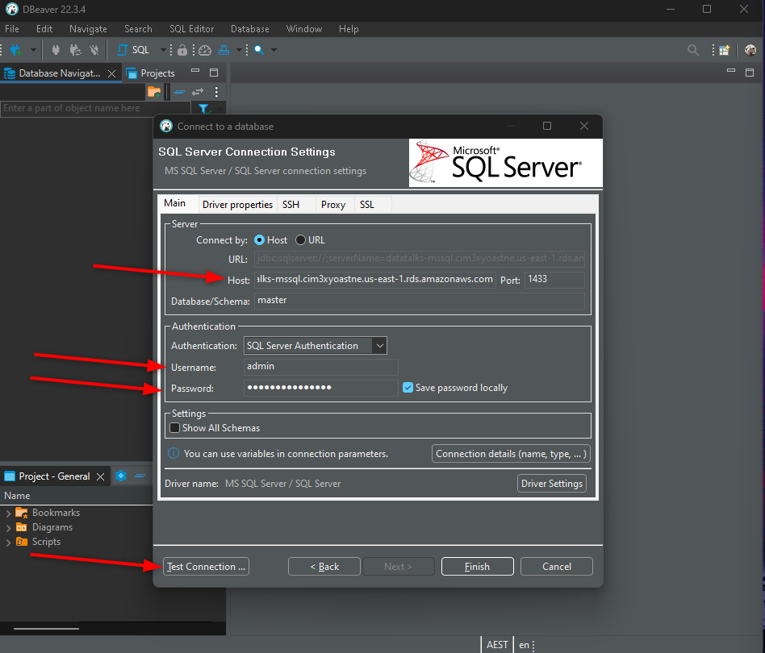
4) Repeat the process to connect to the `PostgreSQL` instance.
5) Right-click on the `MSSQL connection`, select `SQL Editor` and `Open SQL Script`.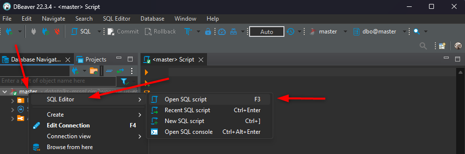
6) Restore the datasets into the RDS MSSQL Server, using the commands below. Make sure to change the S3 bucket name (In the first stage, both of these datasets will be restored in the SQL Server database.).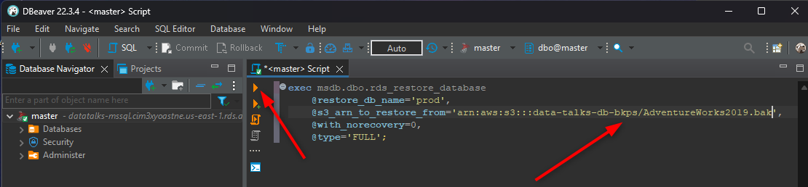

- Production DB
```SQL
exec msdb.dbo.rds_restore_database
	@restore_db_name='prod',
	@s3_arn_to_restore_from='arn:aws:s3:::blacktea/AdventureWorks2019.bak',
	@with_norecovery=0,
	@type='FULL';
```

- Data Warehouse
```SQL
exec msdb.dbo.rds_restore_database
	@restore_db_name='dw',
	@s3_arn_to_restore_from='arn:aws:s3:::blacktea/AdventureWorksDW2019.bak',
	@with_norecovery=0,
	@type='FULL';
```

>To check the stage of the restore you can run this command (update the ID number of the transaction you have just run):

```SQL
exec msdb.dbo.rds_task_status @task_id=1;
```

### Errors and Issues

During the process, you may find some errors. I've highlighted the ones I found and how to fix them.

### Error 1
Database backup/restore option is not enabled yet or is in the process of being enabled.

To fix this issue, I have used these two sources:

- [Create an option group](https://stackoverflow.com/questions/57005157/restore-from-s3-bucket-to-sql-server-getting-error-database-backup-restore-optio)

- [AWS Solution](https://aws.amazon.com/premiumsupport/knowledge-center/native-backup-rds-sql-server/)

### Error 2
MS-CDC has not been enabled on database

We can't run CDC using this version of MSServer. If you are in the required version, then running the command `EXEC sys.sp_cdc_enable_db` will do the trick.

Message when running the command on the current DB:

This instance of SQL Server is the Express Edition (64-bit). Change data capture is only available in the Enterprise, Developer, Enterprise Evaluation, and Standard editions.


### Database Migration Service (DMS)

We will now, load the dw database from MSSQL into the PostgreSQL database using DMS.


## Notes

The database should be created inside a Private subnet and accessed using a VPN or from a EC2 (virtual machine) instance, but for simplicity purposes we will create a database with a Public IP and let your IP connect to it only.

