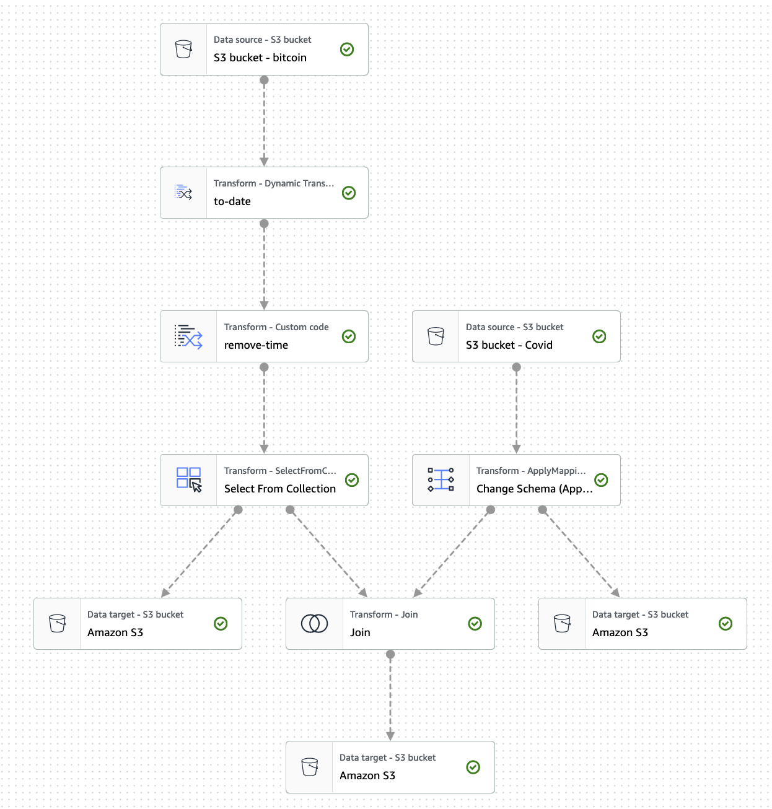
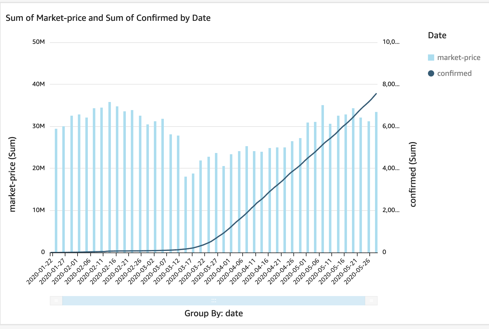

# Workshop 4

## Agenda

- Configure AWS IAM user and CLI (30min)
- Running ETL using the AWS Glue Studio (Covid 19 and Bitcoin dataset) (2hrs)
- Visualise on Quicksight (15min)

### Preamble
Any data projects should only start if we have a particular question that we want to answer! We want to have a purpose and reason why we are transforming and joining datasets together. In this particular case, we are interested to know if Covid (using the number of official confirmed Covid cases) had an effect on the price of Bitcoin. 

We have collected and prepared two datasets (Covid and Bitcoin data) that we will transform and join using a common field between these datasets (date). The transformation will be done using Glue Studio and then we can visualise the results using Quicksight.


## Task 1: Setup the AWS CLI (Command Line Interface)

Besides the user interface that we have used so far, we can also issue commands that modify AWS resources from a command line interface. We are going to run some commands directly from the CLI, so let's set this up now. 

For this we need to configure our credentials. This process will create long term credentials access to your AWS account. This is not the most recommended action (a more secure way would be to only have temporary credentials), but it is still a very popular setup.

In the command line run the following command and paste the information from your IAM user. It will ask for the following information:

```
AWS Access Key ID = grab this from the IAM console 
AWS Secret Access Key = grab this from the IAM console 
Default region name = ap-southeast-2
Default output format = leave it blank
```

In your preferred shell editor run the following command and follow the prompt.
```
aws configure
```
 
If you got an error saying you don't have the aws cli in your computer, go to this [page](https://docs.aws.amazon.com/cli/latest/userguide/getting-started-install.html) to install it.

## Task 2: ETL using Glue Studio

For this task we will closely follow this [AWS Glue Studio Workshop](https://catalog.us-east-1.prod.workshops.aws/workshops/71b5bdcf-7eb1-4549-b851-66adc860cd04/en-US/0-introduction).


### 2a. Copy files using the CLI
1) First we need to copy the required file to our personal S3 bucket. Run the following commands in your CLI. 

```
# this creates a temporary variable in the current shell called BUCKET_NAME. 

# for Mac and Linux OS
export BUCKET_NAME=name_of_bucket 
# for Windows OS
set BUCKET_NAME=name_of_bucket 
# for PowerShell
$Env:BUCKET_NAME=name_of_bucket 

# this creates a folder in your S3 bucket
aws s3api put-object --bucket $BUCKET_NAME --key raw/covid_csv/
aws s3api put-object --bucket $BUCKET_NAME --key raw/btcusd_csv/
aws s3api put-object --bucket $BUCKET_NAME --key curated/

# this copies the file from a different S3 bucket to your own bucket
aws s3 cp s3://covid19-lake/enigma-jhu-timeseries/csv/ s3://$BUCKET_NAME/raw/covid_csv/ --recursive --copy-props none
aws s3 cp s3://blacktea/raw/btcusd_csv/btcusd_raw.csv s3://$BUCKET_NAME/raw/covid_csv/
```

You will notice, the first copy will be successful but the second one will fail. That is expected as we will cover it now.

The first file have been made public available by the owner of the bucket (Johns Hopkins University). The second file is in my personal account and we will have a look at the config now. A lot of current data leaks are coming from misconfigured S3 buckets, so it is good for us to spend some time on this now.

The current best practice to make an object available is via Bucket Policy. We will add the following policy to the source bucket.

```
{
    "Version": "2012-10-17",
    "Statement": [
        {
            "Sid": "AddPerm",
            "Effect": "Allow",
            "Principal": "*",
            "Action": "s3:GetObject",
            "Resource": "arn:aws:s3:::blacktea/raw/btcusd_csv/*"
        }
    ]
}
```
In addition, we will need to uncheck the `Block all public access`. Leave the first two options ticketed, and the last two unticketed. Even though the bucket is now public, only the files contained in the folder `/raw/btcusd_csv/` can be freely downloaded. The rest of the objects are still private.

Run the copy command again - it should work now!


### 2a.(alternative) Copy files using the AWS Console

1) Create three subfolders in the bucket:
    a) raw/covid_csv
    b) raw/btcusd_csv
    c) curated

2) Download these two files to your local and upload to S3 under the specific folder.

    a) [Covid dataset](/files/jhu_csse_covid_19_timeseries_merged.csv) to `raw/covid_csv/`

    b) [Bitcoin Marketprice](/files/btcusd_raw.csv) to `raw/btcusd_csv/`

### 2b. Create a Glue Crawler

1) From AWS Console, go to AWS Glue Console by searching for "Glue".
2) On the left sidebar, choose Crawlers and Add crawler*.
3) Enter "covid_bitcoin_raw_crawler", click Next.
4) Leave the options as "Crawler source type: Data stores" and "Repeat crawls of S3 data stores: Crawl all folders", click Next.
5) In the next window, Ther is a folder icon next to "Include path". Click on this, click on the plus icon next to your bucket, then choose your "raw" folder. Click Next.
6) Do not add another data store. Click Next.
7) Choose "Create an IAM role" and type a name: "covid-bitcoin". Click Next.
8) Leave the "Frequency: Run on demand". Click Next.
9) Click on Add database. Type the database name: "covid-bitcoin". Create the database. Click Next.
10) Click Finish.

### 2c. Create a Glue Job

1) From the AWS Glue Console, click on AWS Glue Studio on the left sidebar. We can now create our job by choosing the "Create and manage jobs" option.
2) Let's start with a "Blank graph" by choosing that option. Then, click Create.
3) Go to "Job details" tab from the top menu. Name your job: "covid-bitcoin-job".
4) Choose an IAM role that has access to your S3 buckets.

#### Load Covid data from S3

#### Load Bitcoin data from S3

#### Joining datasets


### Final result
This is a screenshot of the final glue job.

## Task 3: Visualise on Quicksight

We can now jump in the Quicksight console and create a dashboard for these data.

We will create a new Athena Dataset selecting the joined-curated dataset.

This is a screenshot of the final results. 
